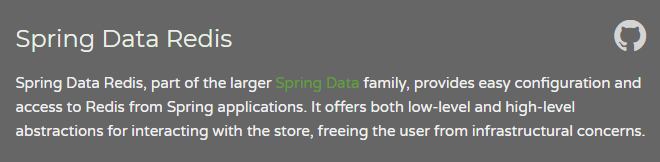
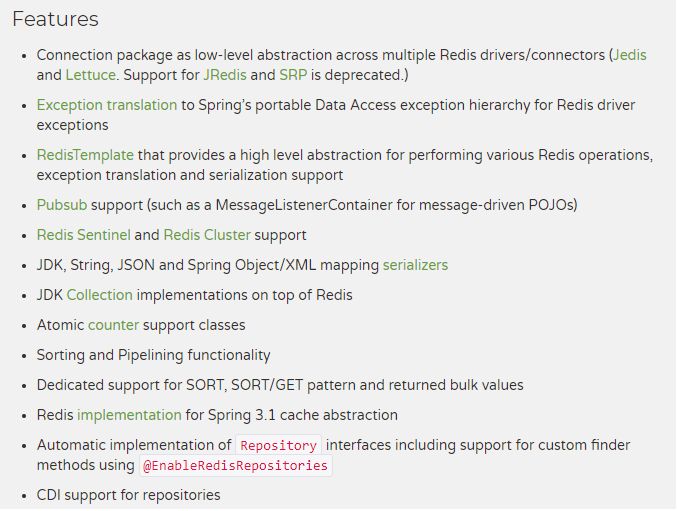
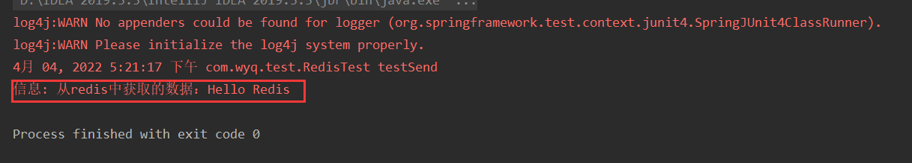
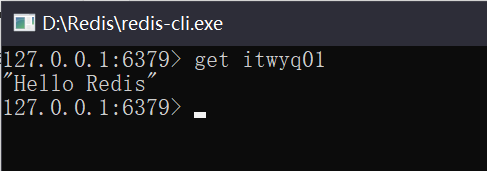
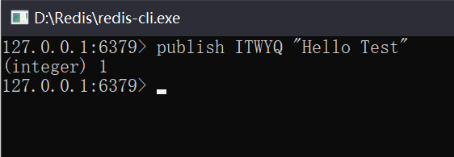
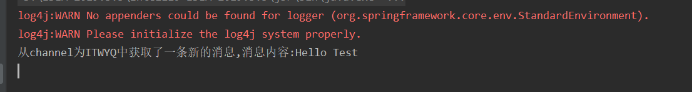

# 一 SpringData-Redis

我们使用redis解决过期优惠券和红包等问题，并且在java环境中使用redis的消息通知。目前世面比较流行的java代码操作redis的AIP有：Jedis和RedisTemplate

Jedis是Redis官方推出的一款面向Java的客户端，提供了很多接口供Java语言调用。

SpringData Redis是Spring官方推出，可以算是Spring框架集成Redis操作的一个子框架，封装了Redis的很多命令，可以很方便的使用Spring操作Redis数据库。由于现代企业开发中都使用Spring整合项目，所以在API的选择上我们使用Spring提供的SpringData Redis

## 1.1 redis的基本操作

**key操作**

- DEL：删除Key，  del key1 key2
- EXISTS：检查key是否存在， EXISTS key
- EXPIRE：设置或者更新到期时间，到期后自动清除，单位秒 设置为-1表示永不过期。 EXPIRE key
- TTL：以秒为单位，返回给定key的剩余生存时间。
- KEYS：查看所有key

**String操作**

- Get：获取
- SET：设置（新增  修改）
- SETNX：只有在KEY不存在时设置value。就是新增一个（不包含更新）。

**Hash操作**

- HMSET key field value [field value ...]：同时将多个 field-value (域-值)对设置到哈希表 key 中。
- HSET key field value：将哈希表 key 中的域 field 的值设为 value 。
- HMGET key field [field ...]：返回哈希表 key 中，一个或多个给定域的值。
- HGET key field：返回哈希表 key 中给定域 field 的值。

**List操作**

- LINDEX key index：通过索引获取列表中的元素。
- LPUSH key value1 [value2] ：将一个或多个值插入到列表头部。
- RPUSH key value1 [value2]：在列表中添加一个或多个值。
- LRANGE key start stop ：获取列表指定范围内的元素。

**Set操作**

- SADD key member [member ...]：将一个或多个 member 元素加入到集合 key 当中。
- SMEMBERS key：返回集合中的所有成员。

**Zset操作**

- ZADD key score1 member1 [score2 member2] ：向有序集合添加一个或多个成员。

## 1.2 SpringData Redis的介绍



特性：



## 1.3 搭建环境

pom.xml文件中加载依赖

```xml
<?xml version="1.0" encoding="UTF-8"?>
<project xmlns="http://maven.apache.org/POM/4.0.0"
         xmlns:xsi="http://www.w3.org/2001/XMLSchema-instance"
         xsi:schemaLocation="http://maven.apache.org/POM/4.0.0 http://maven.apache.org/xsd/maven-4.0.0.xsd">
    <modelVersion>4.0.0</modelVersion>

    <groupId>org.example</groupId>
    <artifactId>Redis-SpringData-Demo1</artifactId>
    <version>1.0-SNAPSHOT</version>

    <properties>
        <spring.version>4.2.4.RELEASE</spring.version>
        <slf4j.version>1.6.6</slf4j.version>
        <log4j.version>1.2.12</log4j.version>
        <springdataredis.version>1.7.4.RELEASE</springdataredis.version>
        <mysql.version>5.1.6</mysql.version>
    </properties>

    <dependencies>
        <!-- spring data redis相关坐标 beg -->
        <dependency>
            <groupId>redis.clients</groupId>
            <artifactId>jedis</artifactId>
            <version>2.6.2</version>
        </dependency>
        <dependency>
            <groupId>org.apache.commons</groupId>
            <artifactId>commons-pool2</artifactId>
            <version>2.2</version>
        </dependency>

        <dependency>
            <groupId>org.springframework.data</groupId>
            <artifactId>spring-data-redis</artifactId>
            <version>${springdataredis.version}</version>
        </dependency>
        <!-- spring data redis相关坐标 end -->


        <!-- spring 相关坐标 beg -->
        <dependency>
            <groupId>org.aspectj</groupId>
            <artifactId>aspectjweaver</artifactId>
            <version>1.6.8</version>
        </dependency>

        <dependency>
            <groupId>org.springframework</groupId>
            <artifactId>spring-aop</artifactId>
            <version>${spring.version}</version>
        </dependency>

        <dependency>
            <groupId>org.springframework</groupId>
            <artifactId>spring-context</artifactId>
            <version>${spring.version}</version>
        </dependency>

        <dependency>
            <groupId>org.springframework</groupId>
            <artifactId>spring-orm</artifactId>
            <version>${spring.version}</version>
        </dependency>

        <dependency>
            <groupId>org.springframework</groupId>
            <artifactId>spring-beans</artifactId>
            <version>${spring.version}</version>
        </dependency>

        <dependency>
            <groupId>org.springframework</groupId>
            <artifactId>spring-core</artifactId>
            <version>${spring.version}</version>
        </dependency>
        <!-- spring 相关坐标 end -->

        <!-- 日志相关坐标 beg -->
        <dependency>
            <groupId>log4j</groupId>
            <artifactId>log4j</artifactId>
            <version>${log4j.version}</version>
        </dependency>

        <dependency>
            <groupId>org.slf4j</groupId>
            <artifactId>slf4j-api</artifactId>
            <version>${slf4j.version}</version>
        </dependency>

        <dependency>
            <groupId>org.slf4j</groupId>
            <artifactId>slf4j-log4j12</artifactId>
            <version>${slf4j.version}</version>
        </dependency>
        <!-- 日志相关坐标 end -->

        <!-- 单元测试相关坐标 beg -->
        <dependency>
            <groupId>org.springframework</groupId>
            <artifactId>spring-test</artifactId>
            <version>4.2.4.RELEASE</version>
        </dependency>

        <dependency>
            <groupId>junit</groupId>
            <artifactId>junit</artifactId>
            <version>4.10</version>
        </dependency>
        <!-- 单元测试相关坐标 end -->

        <!-- druid数据库连接池 beg -->
        <dependency>
            <groupId>com.alibaba</groupId>
            <artifactId>druid</artifactId>
            <version>1.1.9</version>
        </dependency>
        <!-- druid数据库连接池 end -->

        <!-- mysql驱动 beg -->
        <dependency>
            <groupId>mysql</groupId>
            <artifactId>mysql-connector-java</artifactId>
            <version>5.1.6</version>
        </dependency>
        <!-- mysql驱动 end -->

        <!-- mybatis核心包 -->
        <dependency>
            <groupId>org.mybatis</groupId>
            <artifactId>mybatis</artifactId>
            <version>3.4.5</version>
        </dependency>

        <!-- mybatis整合spring -->
        <dependency>
            <groupId>org.mybatis</groupId>
            <artifactId>mybatis-spring</artifactId>
            <version>1.3.1</version>
        </dependency>
    </dependencies>

    <build>
        <finalName>Redis-SpringData-Demo1</finalName>
        <pluginManagement>
            <plugins>
                <plugin>
                    <groupId>org.apache.maven.plugins</groupId>
                    <artifactId>maven-compiler-plugin</artifactId>
                    <version>3.2</version>
                    <configuration>
                        <source>1.7</source>
                        <target>1.7</target>
                        <encoding>UTF-8</encoding>
                        <showWarnings>true</showWarnings>
                    </configuration>
                </plugin>
            </plugins>
        </pluginManagement>
    </build>

</project>
```

整合springData redis的配置

```xml
<?xml version="1.0" encoding="UTF-8"?>
<beans xmlns="http://www.springframework.org/schema/beans"
       xmlns:xsi="http://www.w3.org/2001/XMLSchema-instance" xmlns:aop="http://www.springframework.org/schema/aop"
       xmlns:context="http://www.springframework.org/schema/context"
       xmlns:jdbc="http://www.springframework.org/schema/jdbc" xmlns:tx="http://www.springframework.org/schema/tx"
       xmlns:task="http://www.springframework.org/schema/task"
       xsi:schemaLocation="
		http://www.springframework.org/schema/beans http://www.springframework.org/schema/beans/spring-beans.xsd
		http://www.springframework.org/schema/aop http://www.springframework.org/schema/aop/spring-aop.xsd
		http://www.springframework.org/schema/context http://www.springframework.org/schema/context/spring-context.xsd
		http://www.springframework.org/schema/jdbc http://www.springframework.org/schema/jdbc/spring-jdbc.xsd
		http://www.springframework.org/schema/tx http://www.springframework.org/schema/tx/spring-tx.xsd
		">

    <description>spring-data整合jedis</description>

    <!-- springData Redis 核心api-->
    <bean id="redisTemplate" class="org.springframework.data.redis.core.RedisTemplate">
        <!-- 注入连接工厂 -->
        <property name="connectionFactory" ref="connectionFactory"></property>
        <!-- 设置key的序列化方式 -->
        <property name="keySerializer">
            <bean class="org.springframework.data.redis.serializer.StringRedisSerializer"></bean>
        </property>
        <!-- 设置value的序列化方式 -->
        <property name="valueSerializer">
            <bean class="org.springframework.data.redis.serializer.StringRedisSerializer"></bean>
        </property>
    </bean>

    <!-- jedis连接工厂 -->
    <bean id="connectionFactory" class="org.springframework.data.redis.connection.jedis.JedisConnectionFactory">
        <property name="hostName" value="127.0.0.1"></property>
        <property name="port" value="6379"></property>
        <property name="database" value="0"></property>
        <property name="poolConfig" ref="poolConfig"></property>
    </bean>

    <!-- jedis连接池的配置信息 -->
    <bean id="poolConfig" class="redis.clients.jedis.JedisPoolConfig">
        <property name="maxIdle" value="5"></property>
        <property name="maxTotal" value="10"></property>
        <property name="testOnBorrow" value="true"></property>
    </bean>

</beans>
```

然后测试环境是否搭建成功

```java
import org.junit.Test;
import org.junit.runner.RunWith;
import org.springframework.beans.factory.annotation.Autowired;
import org.springframework.data.redis.core.RedisTemplate;
import org.springframework.test.context.ContextConfiguration;
import org.springframework.test.context.junit4.SpringJUnit4ClassRunner;

import java.util.logging.Logger;

/**
 * @ClassName RedisTest
 * @Description: //TODO 测试redis
 * @Author wyq
 * @Date 2022/3/30 16:50
 */
@RunWith(SpringJUnit4ClassRunner.class)
@ContextConfiguration(locations = "classpath:applicationContext-redis.xml")
public class RedisTest {
    private static Logger log = Logger.getLogger(String.valueOf(RedisTest.class));
    @Autowired
    private RedisTemplate<String, String> redisTemplate;

    @Test
    public void testSend() {
        redisTemplate.opsForValue().set("itwyq01", "Hello Redis");
        String value = redisTemplate.opsForValue().get("itwyq01");
        log.info("从redis中获取的数据：" + value);
    }
}

```

cmd进入Redis安装目录，执行命令启动Redis服务

```
D:\Redis>redis-server.exe redis.windows.conf
```

运行程序，效果如下。





至此已经搭建完成了SpringData Redis的操作环境，并且操作成功

# 二 在Java程序中监听redis消息

## 2.1 配置监听redis信息

如果要在java代码中监听redis的主题消息，我们还需要自定义处理消息的监听器，代码如下

```java
package com.wyq.listener;


import org.springframework.data.redis.connection.Message;
import org.springframework.data.redis.connection.MessageListener;

/**
 * @ClassName RedisMessageListener
 * @Description: //TODO redis信息的监听器
 * @Author wyq
 * @Date 2022/3/30 17:03
 */
public class RedisMessageListener implements MessageListener {
    /**
     * 	处理redis消息：当从redis中获取消息后，打印主题名称和基本的消息
     */
    @Override
    public void onMessage(Message message, byte[] pattern) {
        System.out.println("从channel为" + new String(message.getChannel())
                + "中获取了一条新的消息,消息内容:" + new String(message.getBody()));
    }

}

```

这样我们就定义好了一个消息监听器，当订阅的频道有一条新的消息发送过来之后，通过此监听器中的onMessage方法处理

当监听器程序写好之后，我们还需要在springData redis的配置文件中添加监听器以及订阅的频道主题，

我们测试订阅的频道为ITWYQ，添加配置如下：

```xml
<!-- 配置处理消息的消息监听适配器 -->
    <bean class="org.springframework.data.redis.listener.adapter.MessageListenerAdapter" id="messageListener">
        <!-- 构造方法注入：自定义的消息监听 -->
        <constructor-arg>
            <bean class="com.wyq.listener.RedisMessageListener"/>
        </constructor-arg>
    </bean>

    <!-- 消息监听者容器：对所有的消息进行统一管理 -->
    <bean class="org.springframework.data.redis.listener.RedisMessageListenerContainer" id="redisContainer">
        <property name="connectionFactory" ref="connectionFactory"/>
        <property name="messageListeners">
            <map>
                <!-- 配置频道与监听器
                    将此频道中的内容交由此监听器处理
                    key-ref：监听，处理消息
                    ChannelTopic：订阅的消息频道
                 -->
                <entry key-ref="messageListener">
                    <list>
                        <bean class="org.springframework.data.redis.listener.ChannelTopic">
                            <constructor-arg value="ITWYQ"></constructor-arg>
                        </bean>
                    </list>
                </entry>
            </map>
        </property>
    </bean>
```

## 2.2 测试消息

配置好消息监听，已经订阅的主题之后就可以启动程序进行测试了。由于有监听程序在，只需要已java代码的形式启动，创建spring容器（当spring容器加载之后，会创建监听器一直监听对应的消息）。

```java
package com.wyq.test;

import org.springframework.context.ApplicationContext;
import org.springframework.context.support.ClassPathXmlApplicationContext;

/**
 * @ClassName RedisTest02
 * @Description: //TODO 测试监听器
 * @Author wyq
 * @Date 2022/3/30 17:10
 */
public class RedisTest02 {
    public static void main(String[] args) {
        ApplicationContext ac = new ClassPathXmlApplicationContext("applicationContext-redis.xml");
    }
}

```

当程序启动之后，会一直保持运行状态。即订阅了ITWYQ频道的消息，这个时候通过redis的客户端程序（redis-cli）发布一条消息



> 命令解释：
>
> publish topic名称 消息内容 ： 向指定频道发送一条消息

发送消息之后，我们在来看java控制台输出验证是否获取到了此消息



至此我们已经完成了在java代码中获取redis的消息通知

参考视频：https://www.bilibili.com/video/BV1a4411a7b3?spm_id_from=333.337.search-card.all.click
